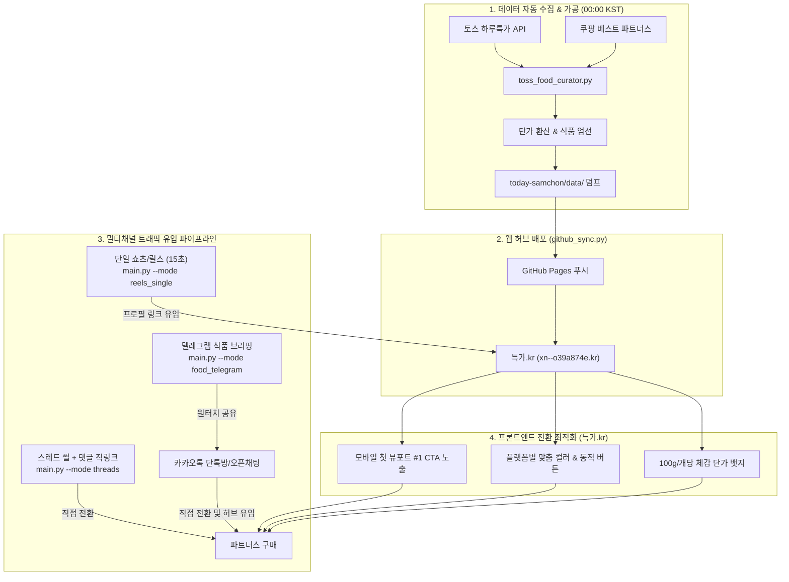

# [통합 개발 및 운영 명세서] 특가.kr 허브 고도화 및 1인 자동화 파이프라인 구축 (월 500만 원 달성용)

## 1. 프로젝트 배경 및 비즈니스 목표

* **최종 비즈니스 목표:** 쿠팡 파트너스(3%), 토스 쉐어링크(3~5%), 네이버 브랜드 커넥트(5~15%) 3대 제휴 채널을 유기적으로 연계하여 **순수 월 수수료 수익 500만 원 달성**.
* **수익 달성 역산 시뮬레이션 (목표 지표):**
  * **일 목표 수수료 수익:** 약 **16.7만 원/일**
  * **일 필요 구매 전환수:** 평균 객단가 25,000원, 평균 수수료율 4% 가정 시 ➡️ 일 **167건** 구매 완료 필요.
  * **일 필요 유효 트래픽:** 구매 전환율(CVR) 4% 달성 기준 ➡️ 일 **4,200명** 유효 클릭/랜딩 방문자 확보.
* **현황 진단 및 핵심 병목점 (Bottlenecks):**
  1. **첫 화면 이탈률(Bounce Rate) 과다:** 모바일 숏폼(유튜브 쇼츠 / 인스타 릴스) 시청자가 프로필 링크(`특가.kr`)로 유입 시, 상단 헤더와 공지 배너 부피로 인해 #1 상품의 핵심 구매(CTA) 버튼이 한 화면에 보이지 않아 스크롤 전 이탈 발생.
  2. **단순한 CTA 및 체감 메리트 부족:** 단순 `바로가기 >` 문구로 인해 클릭 의향(CTR)이 떨어지고, '마트 대비 얼마나 저렴한지(100g당/개당 단가)' 직관적 팩트 체크 부재.
  3. **SNS 알고리즘 페널티:** 스레드(Threads) 발행 시 본문에 외부 링크를 포함하면 플랫폼 도달률(Reach)이 급감하는 문제.
  4. **1인 운영 리소스 한계:** 매일 변경되는 토스/쿠팡 특가 수집, 숏폼 제작, 텔레그램 알림, 카카오톡 오픈채팅방 공유까지 수동 작업 시 지속 불가능.

---

## 2. 전체 시스템 아키텍처 및 파이프라인 흐름



---

## 3. 세부 작업 스코프 (Work Scope)

### Task 1. 프론트엔드 UI/UX 전환 최적화 (`today-samchon/index.html`)
모바일 뷰포트(375px~430px) 기준, 첫 진입 시 스크롤 없이 핵심 구매 버튼이 노출되도록 화면 구조를 개편합니다.

1. **상단 프로필 및 헤더 패딩 축소 (Viewport 최적화):**
   * 상단 공지 마퀴 바(`본 페이지는 토스 쉐어링크...`)와 '특가 캐주는 삼촌' 프로필 영역의 상하 패딩을 약 25~30% 압축.
   * 모바일 첫 화면에서 `#1` 영상 속 상품 카드의 구매 버튼 전체가 스크롤 없이 완전히 노출되도록 화면 높이 최적화.
2. **'오늘 영상 속 상품' 카드 컴포넌트 개선:**
   * **버튼 텍스트 동적 변경:** 단순 `바로가기 >` 제거.
     * 플랫폼 테마에 따라 `네이버 특가 구매 >` (초록), `토스 특가 구매하기 >` (파랑), `쿠팡 최저가 확인 >` (빨강)으로 액션 지향적 텍스트 및 컬러 테마 일관 적용.
   * **체감 단가 / 한 줄 팩트 뱃지 추가:**
     * 가격 영역 상단 또는 인접 위치에 단가 메리트를 보여주는 텍스트 칩 필드(`unit_price_text`) 추가.
     * 예: `100g당 2,490원 | 산지 직송`, `개당 912원 | 마트 대비 40% 저렴`
   * **쇼츠 번호 뱃지 가시성 유지:** 카드 좌측 상단 `#1`, `#2`, `#3` 노란색 뱃지 강조 유지.
3. **카테고리 네비게이션 간소화:**
   * 하단 '삼촌의 추천 특가 테마' 카드 영역의 부피를 줄이고, 모바일 터치에 최적화된 탭(Tab) 또는 가로 슬라이드 칩 필터 형태로 재구성 가능하도록 정리.

---

### Task 2. 백엔드/CLI: 토스 식품 큐레이션 및 텔레그램-카카오톡 연동 (`toss_food_curator.py`)
크롤링된 상품 중 식품/먹거리를 선별하여 카카오톡 전달에 최적화된 텍스트와 원터치 공유 인터페이스를 텔레그램으로 전송합니다.

1. **식품 판별 및 제외 키워드 필터링:**
   * 포함 키워드: `['식품', '밀키트', '간식', '음료', '신선', '과일', '정육', '수산', '라면', '스팸', '김치', '커피']`
   * 제외 키워드: 영양제, 주방잡화, 반려동물 사료 등 비식품군 자동 필터링.
   * 품절 상품(`isSoldOut: true`) 및 할인율 미달(10% 미만) 항목 자동 제외.
2. **체감 단가 자동 계산 모듈:**
   * 상품명 규격/용량/수량 정규식 분석 ➡️ 100g당, 개당, 캔당, 팩당 단가 자동 산출.
3. **카카오톡 최적화 메시지 포맷팅 엔진:**
   ```text
   [오늘의 특가 삼촌] 🍱 토스 하루특가 먹거리 브리핑

   마트 물가 대비 확실히 빠진 식품만 골라왔습니다.
   수량 소진 시 조기 마감될 수 있습니다.

   1️⃣ {상품명}
   • 혜택가: {할인가}원 ({할인율}% 할인)
   • 팩트체크: {100g당/개당 단가} (온라인 최저가 구성)
   👉 특가 확인: {제휴 단축 링크}

   (상위 3~5개 반복)

   ※ 제휴 활동의 일환으로 소정의 수수료를 제공받을 수 있습니다.
   ```
4. **텔레그램 Bot API 전송 및 모바일 공유 브릿지 연계:**
   * 경량 `requests` 기반 전송 모듈 구현 (`TELEGRAM_BOT_TOKEN`, `TELEGRAM_CHAT_ID` 환경변수 연동).
   * 메시지 하단에 Inline Keyboard Button 부착:
     * `📲 카카오톡으로 바로 공유`: 웹 브릿지(kakao_bridge.html)로 연결하여 원터치 공유 트리거.
     * `📋 본문 전체 복사`: 모바일 클립보드 즉시 복사.

---

### Task 3. 스레드(Threads) 도달 극대화 및 직링크 분리 파이프라인 (`threads_generator.py`)
기계적 홍보 문구를 배제하고, 플랫폼 도달률(Reach) 알고리즘을 타기 위한 텍스트 분리 생성 기능을 유지·고도화합니다.

1. **본문(Post)과 링크(Comment) 분리 구조:**
   * 스레드 알고리즘 페널티 방지를 위해 **본문에는 외부 링크를 일절 포함하지 않는 템플릿** 적용.
   * **본문:** 1인칭 공감/물가 팩트 썰 (자취생/직장인 페르소나, 체감 단가 폭로).
   * **첫 댓글(Reply):** 구매 링크 및 공정위 제휴 표기 텍스트 별도 생성.
2. **Gemini AI 기반 카피 생성 및 Fallback 체계:**
   * Google Gemini 모델(`gemini-3.6-flash` 등)을 통한 트렌디한 카피 실시간 생성.
   * 네트워크나 API 장애 시 5종 정적 템플릿으로 무중단 자동 대체.
3. **CLI 실행 출력 규격:**
   * `python main.py --mode threads` 실행 시 `[스레드 본문]`과 `[첫 댓글용 링크]`를 각각 클립보드 복사 및 콘솔 분리 출력.

---

### Task 4. 웹페이지 자동 동기화 및 1인 무인 파이프라인 (`github_sync.py` & `main.py`)

1. **자정 초고속 웹 동기화 (`main.py --mode sync_web`):**
   * 매일 00:00 KST 토스 하루특가 갱신 직후 수집 ➡️ `today-samchon/data/` JSON 파일 생성 ➡️ Git Push까지 5~10초 내 완료.
2. **낮/저녁 피크타임 단일 숏폼 자동화 (`main.py --mode reels_single`):**
   * 15초 단일 상품 숏폼 영상 자동 렌더링.
   * 유튜브 쇼츠 및 인스타그램 릴스 동시 자동 업로드.

---

## 4. 데이터 스키마 규격 (Data Schema)

실제 웹 프론트엔드 연동 파일 규격: `today-samchon/data/shorts_items.json`

```json
[
  {
    "id": 1,
    "title": "국산 흰다리새우 1kg 왕새우 생새우 활새우 회 제철",
    "price_label": "24,900원",
    "original_price": "26,900원",
    "discount_rate": 7,
    "unit_price_text": "100g당 2,490원 | 산지 직송",
    "cta_button_text": "네이버 특가 구매 >",
    "platform": "naver",
    "image_url": "https://dthumb-phinf.pstatic.net/?src=...",
    "link_url": "https://naver.me/50BD3ZGJ",
    "category": "식품",
    "is_featured": true
  }
]
```

---

## 5. 실행 및 검증 가이드 (CLI Commands)

1. **식품 큐레이션 및 텔레그램 전송 테스트:**
   ```powershell
   # 3개 상품 선별 모의 테스트 (Dry-run)
   python main.py --mode food_telegram --limit 3 --dry-run

   # 실제 텔레그램 봇으로 전송
   python main.py --mode food_telegram --limit 4
   ```

2. **스레드 본문 및 첫 댓글 생성 테스트:**
   ```powershell
   python main.py --mode threads
   ```

3. **웹페이지 초고속 동기화 테스트:**
   ```powershell
   python main.py --mode sync_web --force
   ```

4. **단일 숏폼 영상 렌더링 테스트:**
   ```powershell
   python main.py --mode reels_single --no-upload
   ```

5. **도메인 및 정적 리소스 로딩 확인:**
   * 실제 CNAME 퓨니코드: `xn--o39a874e.kr` (`특가.kr`)
   * 모바일 Chrome DevTools(375px~430px)에서 스크롤 없이 `#1` 카드의 CTA 버튼이 100% 화면에 보이는지 검증.